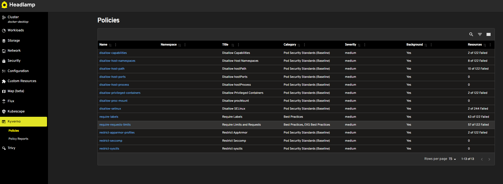
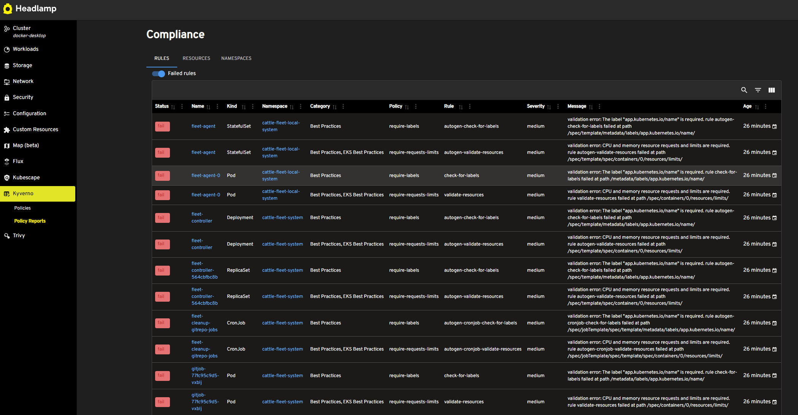

# Kyverno Headlamp Plugin

The Kyverno Headlamp plugin provides an open source plugin for Headlamp. It builds upon the work of [Kyverno](https://kyverno.io/) and [Headlamp](https://github.com/headlamp-k8s/headlamp).

Headlamp is a dashboard for Kubernetes, and is extensible with plugins. Kyverno provides tools to manage the policies in Kubernetes. 

The Kyverno Headlamp plugin provides views in Headlamp for Policies and Reports. 

## Demo

## Prerequisites

- [Kyverno](https://kyverno.io/docs/installation/) should be installed in the k8s cluster.

- [Headlamp](https://github.com/headlamp-k8s/headlamp) should be installed in the k8s cluster or workstation. For a quick test the desktop version is recommended.

## Functionality

- Policy overview 
- Reports view 

## Installation

#### Desktop Headlamp

TODO after release to artifacthub

#### In-cluster Headlamp

- Install Headlamp (https://headlamp.dev/docs/latest/installation/in-cluster/)
- The installation files can be found on the release page in github. Here you can download the tarball. Add an initContainer to the headlamp install to download the plugin files. See [example helm values](https://github.com/Kubebeam/kubescape-headlamp-plugin/blob/main/examples/headlamp-helm-values.yaml).
- Alternatively follow the guidance from headlamp to create a container image with the plugin artifacts: https://headlamp.dev/blog/2022/10/20/best-practices-for-deploying-headlamp-with-plugins/.

## Contributing

Contributions are welcome! Please fork the repository and submit a pull request.

## License

This project is licensed under the Apache-2.0 License. See the LICENSE file for details.

## Contact

For any questions or feedback, please open an issue on the GitHub repository.
